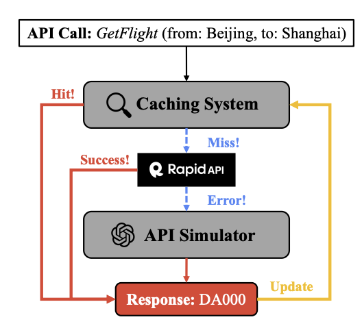

# How does StableToolBench work?

To increase capabilities of LLMs, tool calls were integrated as a way to call external APIs and extract relevant 
information. To test these capabilities, ToolBench was created which consisted of thousands of live public APIs 
formatted 
into 
tool structure to be fed to the LLMs. The LLM was then tested on queries to see how well it could use these tools 
and call them appropriately. The problem that StableToolBench pointed out was that these live APIs couldn't maintain 
functionality throughout time and sometimes could get deprecated or versioned. When StableToolBench published their 
paper, they found that around 50% of the APIs ran into errors when tested and were not available. Thus the old 
benchmark became invalid. To solve this problem, StableToolBench created a virtual API system. They took all the 
APIs from the previous benchmark and grabbed the documentation for each one. Then they created a cached tool calling 
system with two main steps:

1. If API request (tool call) is in the cache, it returns the cached response (json structure)
2. If the API request is not in the cache, they call GPT-4 to simulate a plausible JSON response based on the API 
   documentation. This response is then cached so that future requests will always result in the same response.

Thus, this benchmark achieves reproducibility, stability, and scalability at the cost of the truthfulness and 
realism. However, since the point of the benchmark is to test model functionality, it serves its purpose.
